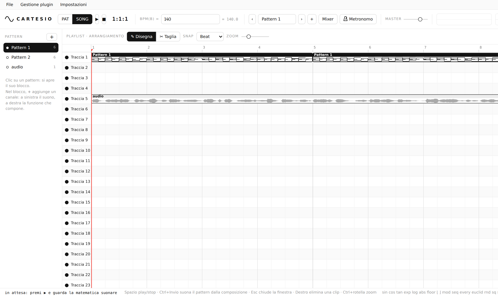

<div align="center">

# 〰 CARTESIO

**La DAW in cui la musica si scrive con le funzioni matematiche.**
*A DAW where music is written with mathematical functions.*

   



</div>

## ⬇ Scarica

| | |
|---|---|
| **Installer** (consigliato) | [**Cartesio-3.13.0-Setup.exe**](../../releases/latest) — installa Cartesio con collegamento sul desktop e nel menu Start |
| **Portatile** | [**Cartesio-3.13.0-portable-win-x64.zip**](../../releases/latest) — estrai la cartella e apri `Cartesio.exe`, senza installare nulla |

**Requisiti:** Windows 10 o 11 a 64 bit · 300 MB liberi · scheda audio qualsiasi.

> Al primo avvio Windows può mostrare «Windows ha protetto il PC»: Cartesio non ha (ancora) una firma digitale a pagamento. Clicca **Ulteriori informazioni → Esegui comunque**.

## Primi passi

1. **File → Demo** carica un progetto d'esempio; premi **Spazio** per ascoltarlo.
2. Clicca un pattern a sinistra: si apre il suo blocco. **+** aggiunge un canale: a sinistra il **suono**, a destra la **composizione**.
3. Prova a scrivere nella composizione `y = minor(seq(x, 0, 2, 4, 7))`.
4. **Gestione plugin** → aggiungi le cartelle dove tieni i tuoi VST3/VST2: i plugin si usano dagli insert del **Mixer**.
5. **File → Esporta audio** per WAV, FLAC, MP3 o OGG.

## Cos'è

In Cartesio non esistono piano roll né note disegnate a mano: ogni canale ha **due funzioni**.

- **Suono** `f(x, t)` — la forma d'onda: `x` è la fase (0 → 2π), `t` i secondi dall'inizio della nota.
- **Composizione** `y(x)` — l'altezza nel tempo: `x` è il beat del pattern, `y` i semitoni. Dove `y` non è definita c'è silenzio; una lista è un accordo.

Anche il tempo è una funzione: `bpm(b)`. Si scrive come si preferisce — testo libero, sintassi Desmos o LaTeX — e il risultato si vede su un piano cartesiano mentre suona.

```text
y = {x mod 1 < 0.5: minor(seq(x, 0, 2, 4, 7))}      // arpeggio in minore
f = fm(x, 2, 3·decay(t, 0.4)) · perc(t, 0.6)          // campana FM
bpm(b) = 120 + 20·smoothstep(0, 32, b)                // accelerando
```

## Funzioni principali

- **Pattern e arrangiamento** in stile FL Studio: channel rack, playlist a 80 tracce, taglio, trascinamento, testina spostabile.
- **Mixer** con 12 insert + master, effetti interni scritti a funzioni (distorsione con curva `f(s)`, riverbero, delay, EQ, compressore, chorus, phaser) e **plugin VST3 / VST2** esterni a 64 e 32 bit, con le finestre dei plugin dentro la DAW e le impostazioni salvate nel progetto.
- **Audio → funzione**: un file audio viene scomposto (trasformata di Fourier) e riscritto come somma di sinusoidi e bande di rumore nel linguaggio di Cartesio.
- **MIDI → funzione**.
- **Esportazione** in WAV (16/24/32 float), FLAC (senza perdita), MP3 (128–320 kbps) e OGG/Opus, con frequenza, canali, coda, dissolvenza, normalizzazione e dither.
- **Metronomo** morbido con accento, **annulla/ripeti** illimitato, **30 lingue** con riconoscimento automatico.
- **Impostazioni audio**: scheda di uscita, buffer, frequenza di campionamento.

Il linguaggio è descritto in [docs/LANGUAGE.md](docs/LANGUAGE.md); l'architettura in [docs/ARCHITECTURE.md](docs/ARCHITECTURE.md).

## Per sviluppatori: avvio dai sorgenti

```bash
npm install          # Electron 33
npm start            # avvia Cartesio
npm run build:host   # compila i ponti VST (richiede mingw-w64)
npm run dist         # installer e zip per Windows in dist/
```

Senza i ponti compilati Cartesio funziona comunque: mancano solo i plugin esterni.

## Struttura

```text
app/                  applicazione Electron
├─ main.js            finestra, file, permessi, avvio del ponte audio
├─ preload.js         API sicure verso la pagina
├─ bridge/            ponte audio (processo dedicato) ↔ host nativi
└─ renderer/          interfaccia
   ├─ index.html
   ├─ css/app.css
   ├─ js/engine.js    linguaggio matematico (pagina + motore audio)
   ├─ js/processor.js motore audio (AudioWorklet)
   ├─ js/app.js       pattern, playlist, mixer, plugin
   ├─ js/ui.js        menu, impostazioni, esportazione, metronomo
   ├─ js/i18n.js      traduzioni · js/languages.js 30 lingue
   └─ vendor/         lamejs (MP3)
native/host/          ponte plugin VST3/VST2 in C++ (Win32)
docs/                 documentazione
```

## Licenza

[MIT](LICENSE) © 2026 Yuri. Componenti di terze parti: [THIRD_PARTY_NOTICES.md](THIRD_PARTY_NOTICES.md).
